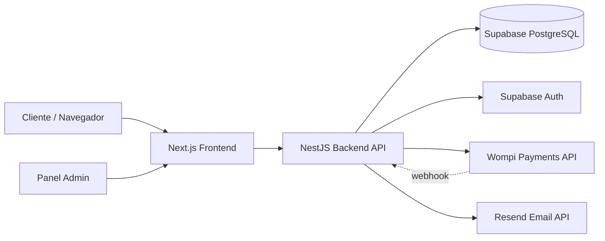

<!-- SDD Artifact | Version: 1.0 | Phase: Plan | Updated: 2026-08-13 -->
<!-- Project: Moramay Café | Feature: 001-tienda-online -->

# Implementation Plan: Tienda Online Moramay Café

## Pre-Implementation Gates (Constitution Compliance)
- [x] Modularity boundary defined — módulos: catalog, orders, subscriptions, customers, admin, auth, payments, shipping
- [x] Interfaces defined before implementation — contratos en `contracts/api-spec.json` (OpenAPI) antes de codificar
- [x] Test strategy defined — Vitest (unit), Jest+Supertest (integración NestJS), Playwright (E2E)
- [x] Config externalizada — variables de entorno en `.env` para ambos proyectos (frontend/backend)
- [x] Error handling strategy defined — formato de error estándar `{ statusCode, message, errorCode }`
- [x] Logging/observability planned — pino (backend), health check `/health`
- [x] Security requirements addressed — Supabase Auth (JWT), RBAC customer/admin, HTTPS, secrets externos
- [x] Performance targets achievable — API p95 <500ms, page load <3s en 4G
- [x] Documentation approach defined — OpenAPI para API, README de arranque <30min

## Architecture Overview

### System Context
Dos aplicaciones desplegadas de forma independiente, ambas contenerizadas con Docker y agnósticas de nube:



### Component Diagram
- **Frontend (Next.js)**: páginas públicas (Home, Tienda, Merch, Nosotros, Contacto), Carrito (estado cliente),
  Checkout, Mi Cuenta (perfil, pedidos, suscripciones), Panel Admin (productos, pedidos, cuentas, suscripciones).
  UI construida con shadcn/ui + Tailwind CSS, totalmente responsive.
- **Backend (NestJS)**: módulos `catalog`, `orders`, `subscriptions`, `customers`, `admin`, `auth`, `payments`,
  `shipping`, `notifications`. Expone API REST documentada con OpenAPI/Swagger.
- **Base de datos (Supabase/PostgreSQL)**: tablas para productos, pedidos, clientes, suscripciones,
  administradores, solicitudes de devolución. Supabase Auth gestiona usuarios y JWT.
- **Pagos (Wompi)**: checkout de pago único y cobro recurrente de suscripciones vía webhook de confirmación.
- **Notificaciones (Resend)**: confirmación de pedido, notificación de cobro de suscripción, invitación de admin.
- **Scheduler**: `@nestjs/schedule` ejecuta job mensual que revisa suscripciones activas y dispara cobro
  automático o notificación de confirmación manual según configuración del cliente.

### Data Flow (Checkout)
1. Cliente agrega productos al carrito (estado local, persistido en `localStorage`).
2. Al hacer checkout, si no está autenticado, se le solicita registrar/loguearse o continuar como invitado.
3. Frontend envía el pedido al backend (`POST /orders`), backend valida stock y calcula envío por ciudad.
4. Backend crea la orden en estado `pending` y genera un link/transacción de pago con Wompi.
5. Cliente paga en Wompi; Wompi notifica al backend vía webhook (`POST /payments/webhook`).
6. Backend actualiza el estado del pedido a `paid`, crea cuenta automática si era invitado, y envía
   confirmación por email (Resend).

### Technology Decisions
| Layer | Choice | Rationale |
|-------|--------|-----------|
| Frontend | Next.js 14 (App Router) + TypeScript | SEO-friendly, SSR/SSG para catálogo, elegido por el cliente |
| UI Components | shadcn/ui + Tailwind CSS | Componentes accesibles, personalizables, desarrollo rápido y responsive |
| Backend | NestJS (TypeScript) | Arquitectura modular y escalable, elegido por el cliente para crecimiento futuro |
| Base de datos | Supabase (PostgreSQL) | Elegido por el cliente; incluye Auth y Storage integrados |
| Autenticación | Supabase Auth (email/password) | Gestión de usuarios lista para usar, JWT compatible con NestJS guards |
| Pagos | Wompi | Proveedor de pagos colombiano elegido por el cliente (tarjetas, PSE, Nequi) |
| Email | Resend | API moderna, developer-friendly, buena entregabilidad |
| Scheduler | @nestjs/schedule | Cron nativo dentro del backend, sin dependencias externas adicionales |
| Contenedores | Docker + docker-compose | Portabilidad total, agnóstico de nube según requerimiento del cliente |
| CI/CD | GitHub Actions | Elegido por el cliente, integración nativa con el repo |
| Testing | Vitest/Jest + Supertest + Playwright | Cumple Artículo III de la constitución (unit, integración, E2E) |

## Project Structure
```
moramay-cafe/
├── apps/
│   ├── web/                     # Next.js frontend
│   │   ├── app/
│   │   │   ├── (public)/        # home, tienda, merch, nosotros, contacto
│   │   │   ├── carrito/
│   │   │   ├── checkout/
│   │   │   ├── cuenta/          # perfil, pedidos, suscripciones (auth requerida)
│   │   │   └── admin/           # panel admin (auth + rol admin requerido)
│   │   ├── components/
│   │   ├── lib/                 # api client, cart store, supabase client
│   │   └── tests/
│   └── api/                     # NestJS backend
│       ├── src/
│       │   ├── catalog/
│       │   ├── orders/
│       │   ├── subscriptions/
│       │   ├── customers/
│       │   ├── admin/
│       │   ├── auth/
│       │   ├── payments/        # integración Wompi + webhook
│       │   ├── shipping/        # cálculo tarifas por ciudad
│       │   └── notifications/   # integración Resend
│       └── test/
├── docker-compose.yml
├── Dockerfile.web
├── Dockerfile.api
└── .github/workflows/
```

## Implementation Phases
- **Phase 0: Research & Validation** — validar integración Wompi (sandbox), definir esquema Supabase,
  configurar entorno Docker local.
- **Phase 1: Foundation** — scaffolding de ambos proyectos, conexión a Supabase, Auth, CI/CD skeleton,
  esquema de base de datos y migraciones.
- **Phase 2: Core (por historia de usuario, en orden de prioridad)** — US-005 (navegación pública) →
  US-001 (compra invitado) → US-003 (perfil cliente) → US-002 (suscripciones) → US-004 (panel admin).
- **Phase 3: Integración & Pulido** — pruebas E2E cruzadas, performance, seguridad, documentación final.

## Risk Assessment
| Risk | Impact | Probability | Mitigation |
|------|--------|-------------|------------|
| Integración de webhooks Wompi falla o se retrasa | Alto | Media | Implementar reintentos, endpoint idempotente, logs detallados |
| Cobro automático de suscripción falla silenciosamente | Alto | Media | Notificar por email en fallo, reintento programado, estado visible en panel admin |
| Cálculo de envío desactualizado (tarifas cambian) | Medio | Baja | Tarifas configurables desde panel admin, no hardcodeadas |
| Two-repo (frontend/backend) desincronización de contratos API | Medio | Media | Contract-first con OpenAPI compartido, generación de tipos TS desde el spec |

## Complexity Tracking
| Component | Estimate | Confidence | Notes |
|-----------|----------|------------|-------|
| Catálogo + carrito | Media | Alta | CRUD estándar + estado de carrito en cliente |
| Checkout + integración Wompi | Alta | Media | Webhooks y estados de pago requieren manejo cuidadoso |
| Suscripciones + scheduler | Alta | Media | Lógica de ciclo mensual, cobro automático/manual, pausas |
| Panel admin | Media | Alta | CRUD sobre entidades ya modeladas |
| Perfil de cliente | Media | Alta | Depende de Auth y Orders ya construidos |
